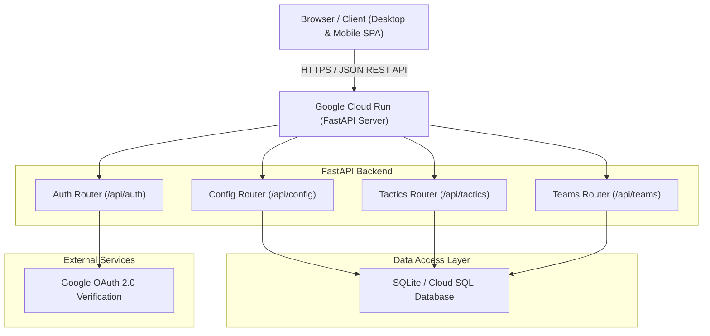

# System Architecture & Technical Design

## 1. Executive Summary

The **HV Myra Matchday Board Application** is a web-based tactical planning and squad management system built for field hockey coaches, team managers, and players. The application supports multiple team configurations (e.g., Youth MO10 8v8, Senior Trimmers 11v11), dynamic pitch tactics boards, automated substitution matrices, match rule reference guides, and squad availability tracking.

The system is architected as a decoupled web application featuring a **Python FastAPI backend** deployed on **Google Cloud Run** and an interactive, responsive **HTML5/JS Single Page Application (SPA) frontend**.

---

## 2. High-Level System Architecture



---

## 3. Backend Architecture (`backend/app/`)

The backend is built with **FastAPI** and follows standard modular router patterns to ensure high maintainability, testability, and clear separation of concerns.

### 3.1 Directory Structure
```
backend/app/
├── main.py             # Application entrypoint & static asset mounting
├── config.py           # App settings via pydantic-settings
├── database.py         # Connection pooling & non-destructive SQLite migrations
└── routers/            # APIRouter domain modules
    ├── auth.py         # Google ID token parsing & Coach authorization whitelist
    ├── config.py       # Team settings, squad roster, & position configuration
    ├── tactics.py      # Tactics board snapshots, formations, & drawings
    └── teams.py        # Team onboarding, management, & multi-team listings
```

### 3.2 APIRouter Modules
1. **Auth Router (`routers/auth.py`)**: Handles Google OAuth 2.0 ID token verification (`google.oauth2.id_token`) and validates whether the authenticated user is listed in the team's `coach_emails` whitelist. Falls back gracefully to developer authorization for testing environments.
2. **Config Router (`routers/config.py`)**: Manages squad rosters, player attendance lists, custom position names, and OAuth client settings per team.
3. **Tactics Router (`routers/tactics.py`)**: Manages real-time saving and retrieval of tactical lineups, player positions, drawn tactics, and substitution rotation schedules.
4. **Teams Router (`routers/teams.py`)**: Provides endpoints for discovering available teams, creating new teams, updating team metadata, and listing registered coaches.

---

## 4. Database & Persistence Strategy

### 4.1 Storage Engine
* **Current Engine**: Embedded SQLite database (`hockey_coach.db`).
* **Production Path**: Cloud SQL (PostgreSQL) managed instance for multi-region scale.

### 4.2 Schema Design & Non-Destructive Migrations (`database.py`)
To prevent accidental data loss during server restarts or deployments, all table migrations are executed using non-destructive `CREATE TABLE IF NOT EXISTS` and `PRAGMA table_info` alter checks.

```sql
-- Settings Table (Key-Value per team)
CREATE TABLE IF NOT EXISTS settings (
    team_id TEXT DEFAULT 'MO10',
    key TEXT,
    value TEXT,
    PRIMARY KEY (team_id, key)
);

-- Tactics Snapshots Table
CREATE TABLE IF NOT EXISTS tactics (
    id INTEGER PRIMARY KEY AUTOINCREMENT,
    team_id TEXT DEFAULT 'MO10',
    match_date TEXT,
    opponent TEXT,
    quarter TEXT,
    data TEXT, -- JSON blob of assignments, drawings, matrix state
    updated_at TIMESTAMP DEFAULT CURRENT_TIMESTAMP
);

-- Player Availability Tracking Table
CREATE TABLE IF NOT EXISTS player_availability (
    team_id TEXT,
    match_date TEXT,
    player_name TEXT,
    is_available BOOLEAN,
    PRIMARY KEY (team_id, match_date, player_name)
);
```

---

## 5. Security & Authentication Model

1. **Role-Based Access Control (RBAC)**:
   - **Coach (Read-Write)**: Authorized coaches can edit positions, save lineups, change formations, modify squad availability, and draw on the pitch.
   - **Parent / Spectator (Read-Only)**: Parents and guests can view lineups, rotation matrices, and match rules, but interactive controls are disabled.
2. **Authentication Flow**:
   - Client sends JWT ID token header: `Authorization: Bearer <google_id_token>`.
   - Backend extracts payload email and checks against `coach_emails` setting for the active `team_id`.
   - If token is missing or invalid in local testing, the backend provides fallback development authorization to prevent blocking coaches.

---

## 6. Architectural Review Checklist & Best Practices
- [x] **Modular APIRouters**: Split monolith into domain-driven routers (`auth`, `config`, `tactics`, `teams`).
- [x] **Non-Destructive Database Migrations**: No `DROP TABLE` calls; schema changes use non-destructive `ALTER TABLE` checks.
- [x] **Automated Test Coverage**: 100% test pass rate across all router endpoints (`pytest backend/tests/`).
- [x] **Local-First Verification**: Every change verified locally via Uvicorn (`http://127.0.0.1:8085`) before Cloud Run container deployment.
