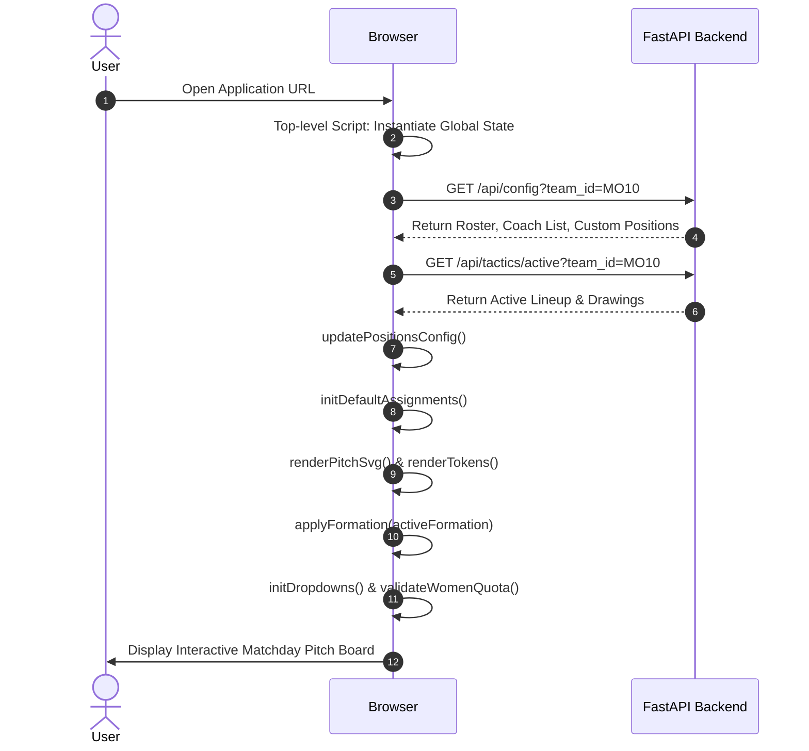

# Frontend Architecture, State Lifecycle & Refactoring Roadmap

## 1. Overview & Architecture

The frontend is an interactive **Single Page Application (SPA)** engineered for tablet, mobile, and desktop touch interfaces used on the pitch sidelines. It provides real-time tactical board management, substitution matrix calculation, women quota enforcement, and read-only match sheet generation.

---

## 2. Global State Scope & Execution Lifecycle

### 2.1 The JavaScript Temporal Dead Zone (TDZ) Fix
In JavaScript ES6+, variables declared with `let` or `const` exist in a Temporal Dead Zone (TDZ) from the start of script execution until the line where they are defined. Accessing a `let` variable prior to its definition line causes a runtime `Uncaught ReferenceError`.

To eliminate TDZ crashes permanently, all global application state variables are consolidated at the **very top of the `<script>` tag**:

```javascript
// Top of Script Scope (frontend/index.html)
let currentLang = 'en';
let subMatrixState = {};
let googleClientId = '1083993716124-...';
let coachEmails = JSON.parse(localStorage.getItem('hv_myra_coaches')) || ["..."];
let currentUserRole = 'parent';
let currentTeam = localStorage.getItem('hv_myra_active_team') || 'MO10';
let activeFormation = (currentTeam === 'MO10') ? '1-2-3-2' : '4-3-3';
let currentAssignments = {};
let customPositionNames = JSON.parse(localStorage.getItem('hv_myra_custom_positions')) || {};
let squadPlayers = [...];
```

### 2.2 Controlled Initialization Sequence (`window.onload`)
UI initialization calls (token rendering, dropdown population, pitch SVG generation) execute inside `window.onload` after DOM elements exist and config data is fetched from `/api/config`:



---

## 3. Key Algorithms & UI Modules

### 3.1 Robust Position Dropdown Fuzzy Matching (`populateSelectWithOptions`)
When rendering player select pills below pitch position tokens, `populateSelectWithOptions` uses fuzzy matching to map saved names (`Liz`) to roster names (`Liz Wysocki`) or vice versa:

```javascript
let matchVal = '';
if (selectedValue) {
  const targetLower = selectedValue.toLowerCase().trim();
  const targetFirst = targetLower.split(' ')[0];
  
  const exactMatch = allOptionValues.find(v => v.toLowerCase().trim() === targetLower);
  if (exactMatch) {
    matchVal = exactMatch;
  } else {
    const firstMatch = allOptionValues.find(v => {
      const vLower = v.toLowerCase().trim();
      const vFirst = vLower.split(' ')[0];
      return vFirst === targetFirst || vLower.includes(targetFirst) || targetLower.includes(vFirst);
    });
    if (firstMatch) matchVal = firstMatch;
  }
}
select.value = matchVal;
```

### 3.2 Dynamic Women Quota Validation (`validateWomenQuota`)
For co-ed leagues (such as Trimmers 11v11), KNHB rules mandate a minimum of **4 women on the pitch**:

- **Pitch Token Filter**: Filters position tokens where `!pos.isSub`.
- **Bench Token Exclusions**: Excludes substitute bench tokens (`SUB 1` .. `SUB 10`, `SUB DEF`, `SUB MID`).
- **Substitution Sync**: Moving a female player from pitch to substitute bench triggers `onPositionChanged()` -> `validateWomenQuota()`, instantly highlighting quota warnings if active pitch count drops below 4.

---

## 4. Modernization & Refactoring Roadmap

To support long-term maintainability and multi-developer team collaboration, the monolithic `frontend/index.html` is planned for refactoring into a modern component architecture:

```
frontend/ (Target React + Vite + TypeScript Structure)
├── src/
│   ├── components/
│   │   ├── PitchBoard/       # SVG pitch rendering & drag-and-drop canvas
│   │   ├── RosterSidebar/    # Player attendance & guest adding UI
│   │   ├── RotationMatrix/   # Substitution rotation schedule planner
│   │   └── MatchHeader/      # Team selector & date/opponent bar
│   ├── hooks/
│   │   ├── useTactics.ts     # React Query hooks for fetching/saving tactics
│   │   └── useTeamConfig.ts  # Team config & authorization state
│   ├── types/
│   │   └── index.ts          # TypeScript interfaces for Squad, Tactics, Formations
│   ├── App.tsx
│   └── main.tsx
├── package.json
└── vite.config.ts
```
