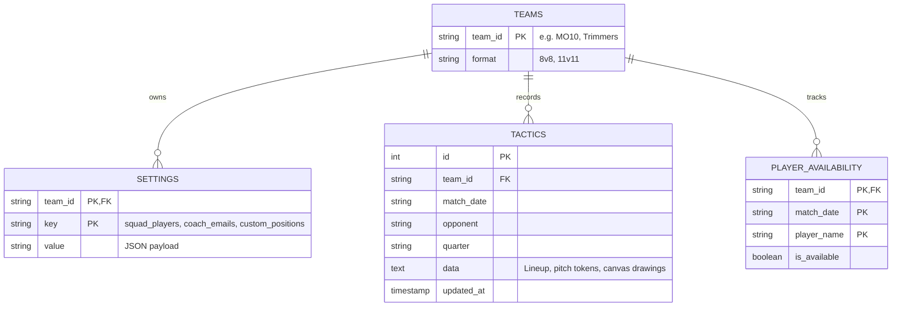

# Multi-Tenant & Multi-Team Architecture Design

## 1. Context & Objectives

The application supports multiple hockey teams under the HV Myra organization (and future guest clubs). Different teams operate under distinct game formats, squad sizes, gender quota rules, and tactical requirements:

1. **HV Myra MO10 (Youth 8 vs 8)**:
   - **Pitch Format**: Half-pitch / cross-pitch (8 active players on pitch: 1 GK + 7 field players).
   - **Formations**: Primary `1-2-3-2` (Attacking), `1-3-3-1` (Defensive), `1-2-4-1` (Possession).
   - **Substitute Dugout**: 2 substitutes (`SUB DEF` / `SUB MID`).
   - **Roster Naming**: First names formatted cleanly for clarity on youth pitch boards (`Liz`, `Liv`, `Defne`, `Hannah`, `Kyra`, `Mira`, `Alina`, `Shanaya`, `Kate`, `Sai`).

2. **HV Myra Trimmers (Senior Rec 11 vs 11)**:
   - **Pitch Format**: Full international pitch (11 active players: 1 GK + 10 field players).
   - **Formations**: Primary `4-3-3`, `3-4-3`, `4-4-2`, `3-5-2`.
   - **Substitute Dugout**: Up to 10 substitutes (`SUB 1` .. `SUB 10`).
   - **Gender Quota Rule**: Minimum **4 women on pitch** at all times.

---

## 2. Multi-Team Data Model (`team_id` Partitioning)

Every configuration key, tactical lineup, drawing layer, and player availability record is isolated by `team_id`.



---

## 3. Team Onboarding & Selector API (`/api/teams`)

### 3.1 Fetching Available Teams
```http
GET /api/teams HTTP/1.1
Host: hockey-coach-app-1083993716124.europe-west4.run.app
```

**Response (JSON)**:
```json
[
  {
    "team_id": "MO10",
    "coach_emails": ["singhalrajeev89@gmail.com"],
    "player_count": 10
  },
  {
    "team_id": "Trimmers",
    "coach_emails": ["singhalrajeev89@gmail.com"],
    "player_count": 21
  }
]
```

### 3.2 Dynamic Team Switching Flow
1. Client selects team from top header dropdown (`<select id="teamSelector">`).
2. `changeTeam(teamId)` updates `currentTeam` in `localStorage`.
3. Client requests `GET /api/config?team_id=${teamId}` and `GET /api/tactics/active?team_id=${teamId}`.
4. Pitch layout dynamically re-adjusts token coordinates (`updatePositionsConfig()`), formation options (`formationsMO10` vs `formationsTrimmers`), and substitution matrix columns.

---

## 4. Architectural Safeguards for Multi-Tenancy
- **Strict Scope Filtering**: All backend queries append `WHERE team_id = ?` to prevent cross-team data leaks.
- **Independent Squad Rosters**: Modifying squad players in `MO10` does not affect `Trimmers` rosters or rotation schedules.
- **Isolated Tactics Boards**: Tactical drawings, formations, and saved match sheets are indexed by `(team_id, match_date)`.
